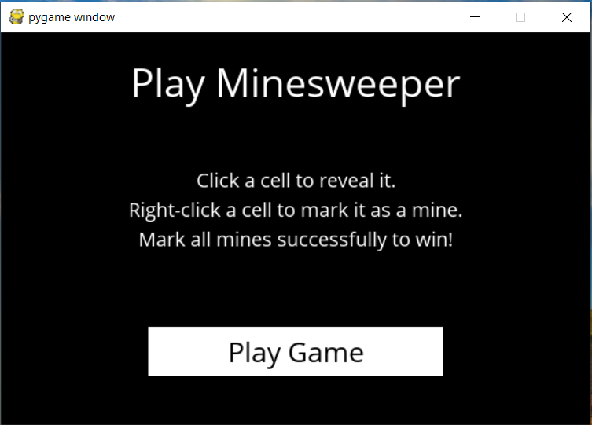
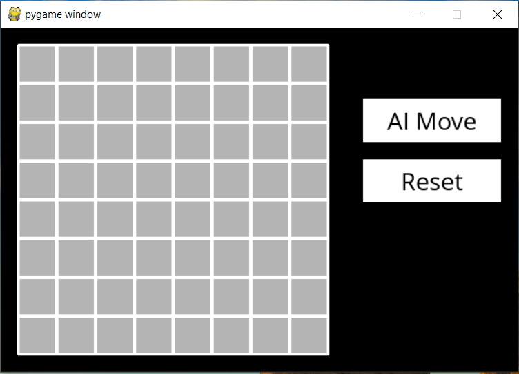
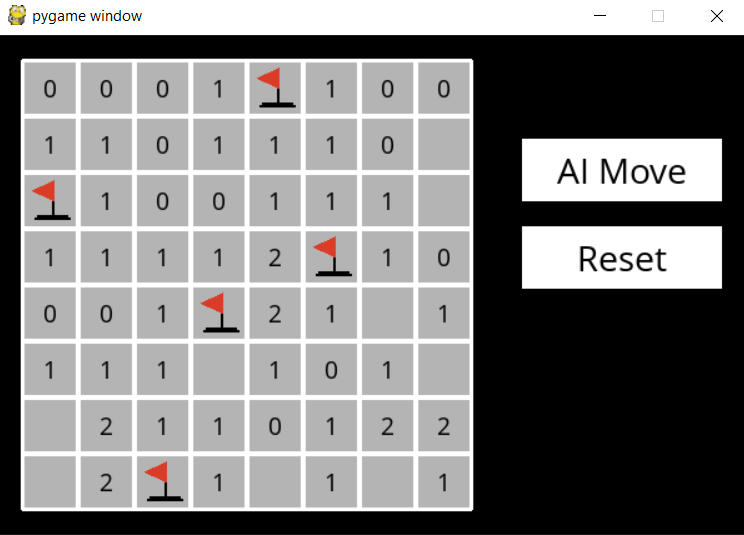
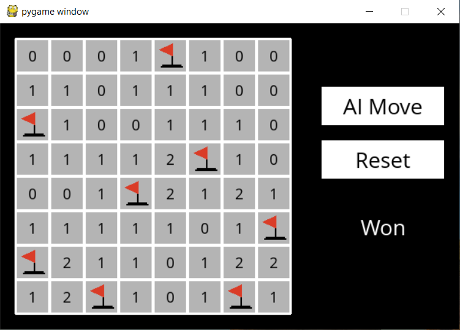

# Minesweeper - AI
In this project, we write an AI to play the famous game of **Minesweeper**, using knowledge from previous state and the knowledge from current state.

## Background 
Minesweeper is a puzzle game that consists of a grid of cells, where some of the cells contain hidden “mines.” Clicking on a cell that contains a mine detonates the mine, and causes the user to lose the game. Clicking on a “safe” cell (i.e., a cell that does not contain a mine) reveals a number that indicates how many neighboring cells – where a neighbor is a cell that is one square to the left, right, up, down, or diagonal from the given cell – contain a mine.

The goal of the game is to flag (i.e., identify) each of the mines. In many implementations of the game, including the one in this project, the player can flag a mine by right-clicking on a cell (or two-finger clicking, depending on the computer).

  

## Flow of Game :
1. User is provided with the instructions to the game and is prompted to start.
2. User is taken to a 8x8 grid of tiles, hiding mines and number of surrounding mines, underneath.
3. User can make a manual move or use AI's help to uncover the tiles on the grid.
4. Each move is registered and knowledge ,based on the current state, is updated for the AI.
5. If a move uncovers a mine, the user loses and the game ends.
6. If all the tiles have been uncovered or all the mines have been flagged , the user wins and the game ends.
7. Once the game ends, user is prompted to reset the board with a new set of mines.

## Functions and Classes :

1. **runner.py** : Manages the interface for the game. Records actions and calls the various functions to act accordingly.
2. **minesweeper.py** : Contains the logic for the game.
  - *Minesweeper* : Handles game play. Contains attributes and methods to initialize the board, to track found mines, to track the number of nearby mines for a cell etc.
  - *Sentence* : Represents knowledge for AI in the form : {set of cells} = number of mines . For example: {(1,2),(1,3)} = 1 , states that 1 out of the present cells is a mine.
  - *MinesweeperAI* : Implements AI , that can play *Minesweeper*.
     - self.knowledge : records all the sentences generated from the moves played so far.
     - self.mines : set of cells known to be mines.
     - self.safes : set of cells known to be safe.
     - self.moves_made : set of cells already uncovered.
     - mark_mine(cell) : marks a cell as mine
     - mark_safe(cell) : marks a cell as safe
     - add_knowledge(cell) : makes a move at input cell and generates a sentence that can be derived from this move. Adds the sentence to the knowledge. Also , updates the inferences derived from this new knowledge.
     - make_safe_move() : AI returns a cell from the set of safe cells if it is not yet uncovered.
     - make_random_move() : if no safe move is available, it returns the randomly selected cell from the set of available moves
