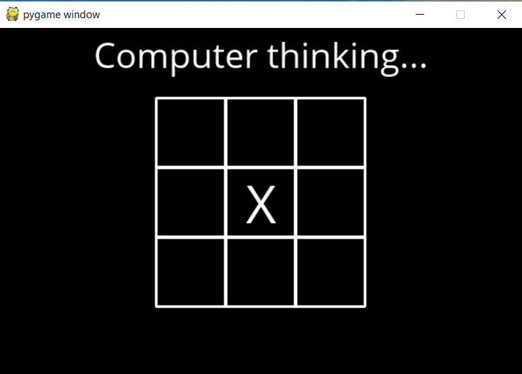
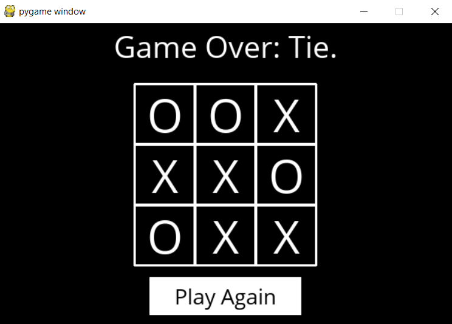

# Tic Tac Toe

In this project, we write an AI to play a game of Tic-Tac-Toe, optimally.

## Files present:

1. **runner.py** : Contains code to run the graphical interface
2. **tictactoe.py** : Contains logic for playing the game

## Flow of game:

1. On running *runner.py* on terminal (command - python runner.py), a gui opens to prompt the user to select player (X or O )
2. Each game starts with X . If user picks X, computer plays as O and waits for the user to make a move. Otherwise, AI makes the move as X.
3. Computer finds and plays the optimal move to the current state of the board. *(tictactoe.py)*
4. If the game terminates i.e if either player wins or the game ends up in draw, user is prompted to start the game again.

## Functions - tictactoe.py :

1. **player(board)** : Returns the player having the current turn (X or O).
2. **actions(board)** : Returns a set of permissable actions given the current state of board.
3. **result(board,action)** : Returns the state of board after taking the passed action.
4. **winner(board)** : Returns the winner given the current state of board ( X , O or None).
5. **terminal(board)** : Returns whether the game has terminated or not (True or False).
6. **utility(board)** : Returns utility of the game on termination(1 : if X wins, -1 : if O wins , 0 : if it's a tie).
7. **minimax(board)** : Returns the optimal action for AI given the current board. Traverses a tree of possible game states of min anad max values . Uses alpha-beta pruning to limit the computation cost.
